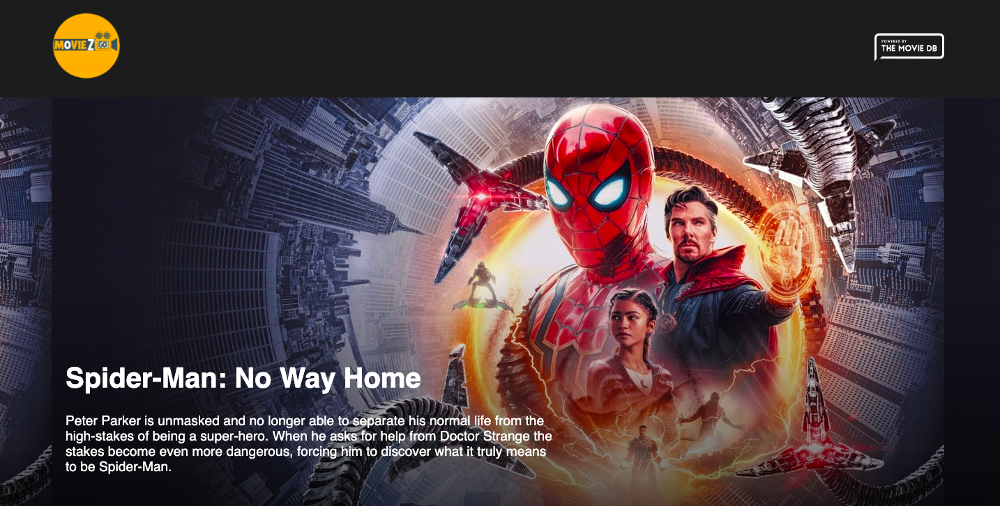
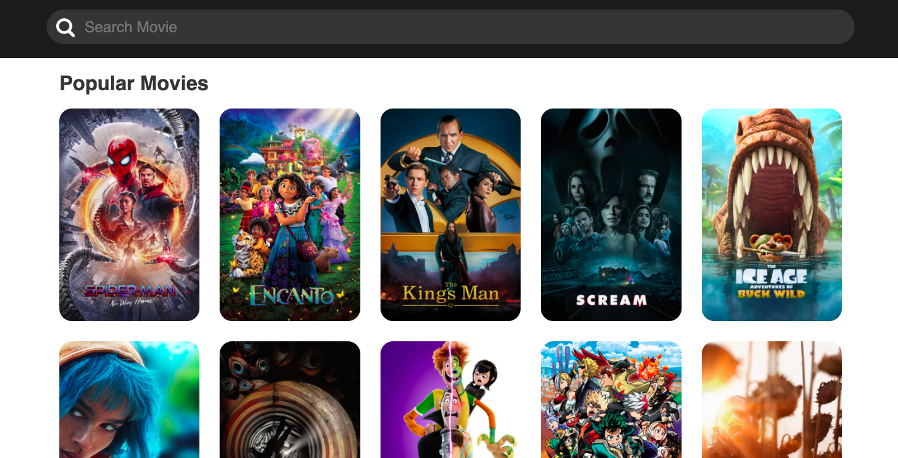

## REACT MOVIES-BOX APP

### Description: A nice movies-box application , built with react, javascript, html/css, that affords users a lovely UI to view their favourite and choice movies, see movie characters, movie ratings and details of all the movies.

HOW TO USE

1. Clone the repo

2. Install dependencies

run yarn install

3. Start the development server

run yarn start

😊 What's Next?
This App will be constantly updated to include more features like

-view trailers
